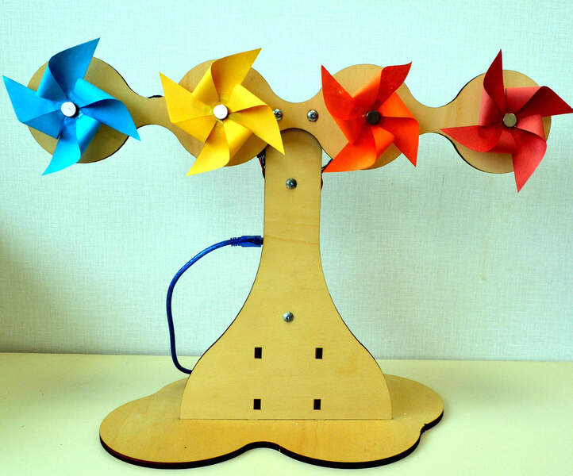

# PinWheels@LAB

**PinWheels@LAB** is a display device that rotates four pinwheels to convey information ambiently. This small device, that teachers can bring into the classroom or install in school labs, is a tribute to the PinWheels installation(1) from the MIT Tangible Media Lab. Beyond extending Python programming lessons to data treatment and IoT communication, PinWheels@LAB enables students' thinking about innovative ways to convey information and to feel physical data representation in the classroom.

(1) Hiroshi Ishii, Sandia Ren, and Phil Frei. 2001. Pinwheels: visualizing information flow in an architectural space. In CHI '01 Extended Abstracts on Human Factors in Computing Systems (CHI EA '01). Association for Computing Machinery, New York, NY, USA, 111–112. [https://doi.org/10.1145/634067.634135](https://doi.org/10.1145/634067.634135)

_Bring an ambient display in the classroom!_

## Getting Started

### Prerequisites

* Python &ge; 3.15 is required ([downloads](https://www.python.org/downloads/))
  * The controller has been tested on Python version 3.15.5.

* Eclipse Mosquitto server &ge; 2.0 ([downloads](https://mosquitto.org))
    * The controller has been tested with Mosquitto version 2.0.21 and Callback API version 2
    * Check configuration in mosquitto.conf file (e.g., `/etc/mosquitto/mosquitto.conf`):
        * `listener 1883 0.0.0.0`
        * `allow_anonymous true`

* Arduino IDE &ge; 1.8 ([downloads](https://docs.arduino.cc/software/ide/))
  * The driver has been tested on Arduino IDE 1.8.19
  * Packages:
      * digitalWriteFast 1.2.0
      * Protothreads 1.4.0-arduino.beta1

### Hardware requirements

* Fabrication
  * [2×] Plywood planks of 6-mm thickness (300 × 600 mm)
  
* Mechanics
  * [4×] Nuts and bolts: M3 L16
  * [4×] Magnets
  * [4×] Collars: D5
  * [16×] Bolts: M3 L10

* Mechatronics
  * [4×] Nema14 stepper motors: 14HS11-1004S
  * [4×] Stepper drivers: Pololu A4988

* Electronics
  * [1×] Arduino Nano
  * [4×] Capacitors: 100 µF
  * [3×] Breadboards: 170 points (55 × 30 mm)
  * [1×] Two-way terminal block
  * [1x] Power supply: 18V 2A

* Computers
  * [0×, 1×, or 2×] Raspberry Pi 3 ou 4 (see five [possible setups](./doc/communication/communication-diagram.svg))
  * [1×] USB adapter or conversion cable
    * If Arduino Nano "Genuine" or "Clone": Type-A / Mini Type-B
    * If Seeduino Nano: Type-A / Type-C
  * [1×] USB extension cable: Type-A / Type-A (e.g., length of 1 m)

### Installation

You can get the latest versions by [zip download](https://github.com/gurivier/PinWheels-LAB/archive/refs/heads/main.zip) or by git clone:

`git clone https://github.com/gurivier/PinWheels-LAB.git`

Releases are available from [releases list](https://github.com/gurivier/PinWheels-LAB/releases).

#### Dependencies

`pip3 install paho-mqtt serial`

### Help

Print general help page: `python3 pinwheels_lab.run.py -h`

Print a command's help: `python3 pinwheels_lab.run.py <command> -h`
    * Available commands: `mqtt`, `prompt`, `demo`

## Author

Guillaume Rivière, [ESTIA](https://www.estia.fr), France. ([@gurivier](https://github.com/gurivier/))

## License

Source code is released under the [MIT](https://choosealicense.com/licenses/mit/) license.

Fabrication files are released under the [CC BY-SA 4.0](https://creativecommons.org/licenses/by-sa/4.0/) license.

Documentation is released under the [CC BY-SA 4.0](https://creativecommons.org/licenses/by-sa/4.0/) license.

## Versions' History

* 0.9.1 (2026-08-17)
  * Adding shell scripts for MQTT supervision and testing
* 0.9.0 (2026-08-16): First publication
  * This first publication includes:
     * `doc/`: documentation for electronics (wiring), communication (5 possible setups), hardware (photos of the device), and classroom (setup's description for students)
     * `fab/`: files for printing and folding pinwheels from paper sheets (folding patterns), and fabrication of wooden parts by laser cutting (SVG, DXF, and PS files) for NEMA14 stepper motors
     * `src/`: the source files for the Python controller and the C++ Arduino driver

---
 Guillaume Rivière, 2021-2026, [ESTIA](https://www.estia.fr), France.
